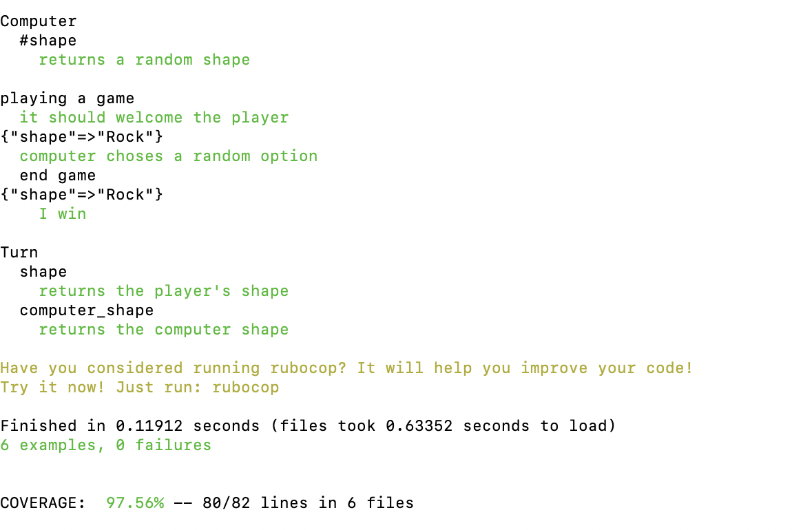

# Rock Paper Scissors Challenge


Week 3 Makers Academy weekend challenge. The code has been refactored to follow the MVC architecture.  The original code had some logic in the view.  

## Please start by

Cloning this repo
```
git clone git@github.com:LisaMcCormack/rps-challenge.git
```
```
bundle
```
To run the server
```
rackup
```
Then in the browser go to port indicated on the server, usually localhost:9292

## Instructions from original Makers <a href="https://github.com/makersacademy/rps-challenge">repo</a>

Task
----

Knowing how to build web applications is getting us almost there as web developers!

The Makers Academy Marketing Array ( **MAMA** ) have asked us to provide a game for them. Their daily grind is pretty tough and they need time to steam a little.

Your task is to provide a _Rock, Paper, Scissors_ game for them so they can play on the web with the following user stories:

```
As a marketeer
So that I can see my name in lights
I would like to register my name before playing an online game

As a marketeer
So that I can enjoy myself away from the daily grind
I would like to be able to play rock/paper/scissors
```

Hints on functionality

- the marketeer should be able to enter their name before the game
- the marketeer will be presented the choices (rock, paper and scissors)
- the marketeer can choose one option
- the game will choose a random option
- a winner will be declared


## Basic Rules

- Rock beats Scissors
- Scissors beats Paper
- Paper beats rock

## Test coverage



Test coverage is at 97.56%
